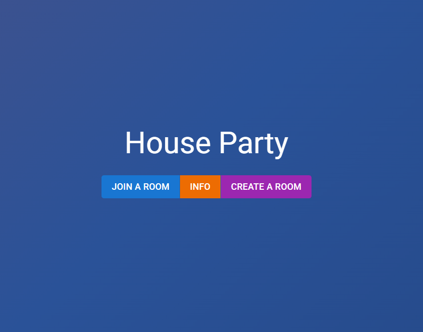
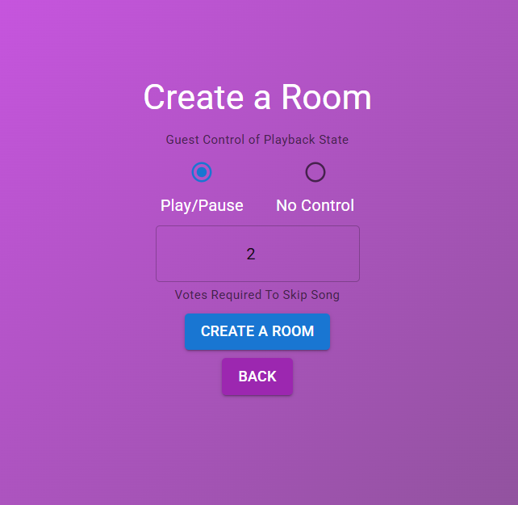
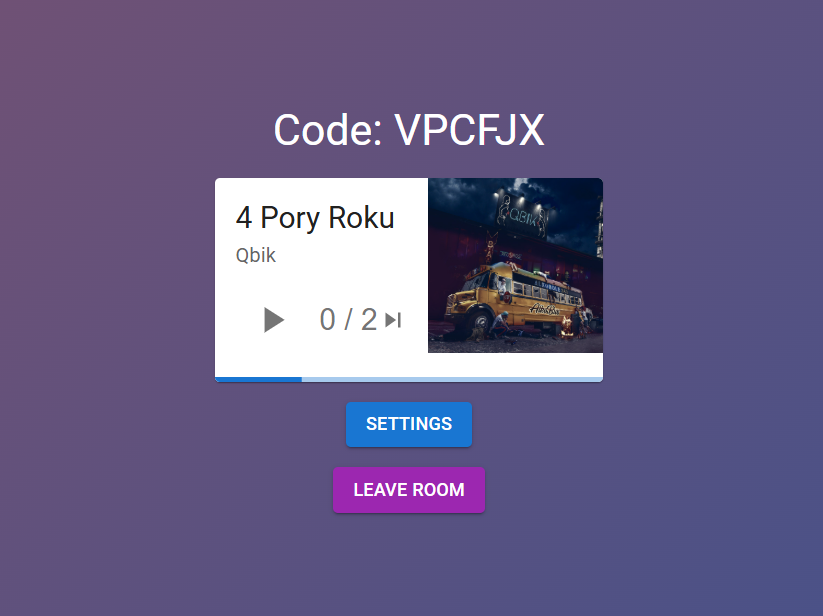

# Spotify Web App

A modern web application built with **React** and **Django** that integrates with Spotify to enhance your music experience with friends.

---

## 📸 Screenshots

### Welcome & Authentication

  

### Creating or Joining a Room

  

### Music Player Interface

  

---

## 🛠️ Built With

- **Frontend:** React, Material-UI (MUI)
- **Backend:** Django, Django REST Framework
- **Integration:** Spotify Web API

---

## 🎵 Spotify Integration Details

### ⚠️ Premium Account & Login Required
To fully utilize the features of this application, **a Spotify login is strictly required**. Because it interacts with active playback, users must have an active subscription/account to control or stream music through the app.

### 🔐 API & Authentication
This application communicates directly with the **Spotify Web API**. 
- It uses the official **Spotify OAuth 2.0 authorization flow** to securely log users in.
- The app handles user permissions securely without ever saving or accesssing your raw Spotify password.
- Once authorized, the application syncs and controls the music player state in real-time.

---

## 🚀 Getting Started

1. Clone the repository.
2. Set up your Django environment and add your Spotify API credentials (`SPOTIFY_CLIENT_ID`, `SPOTIFY_CLIENT_SECRET`, `SPOTIFY_REDIRECT_URI`) to your backend settings.
3. Install frontend dependencies using `npm install` inside the React project folder.
4. Run both the Django development server and the React development server to start using the app.
